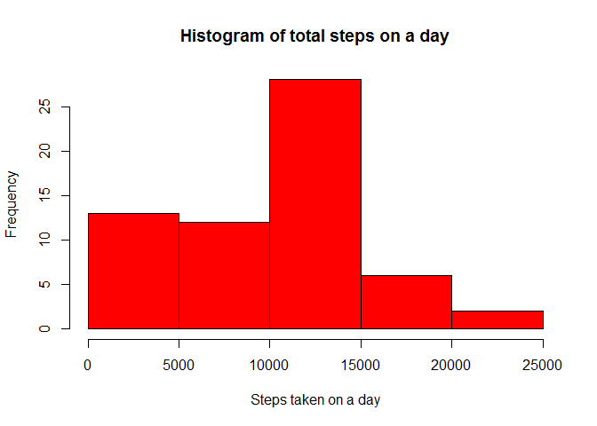
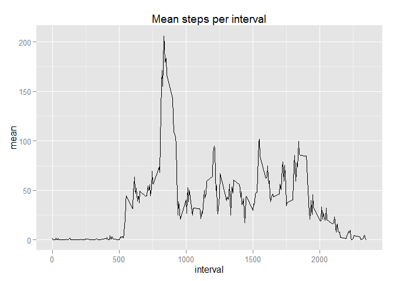
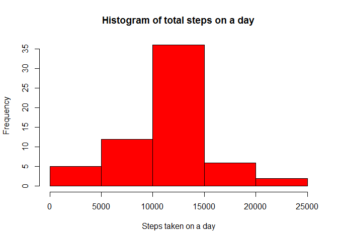
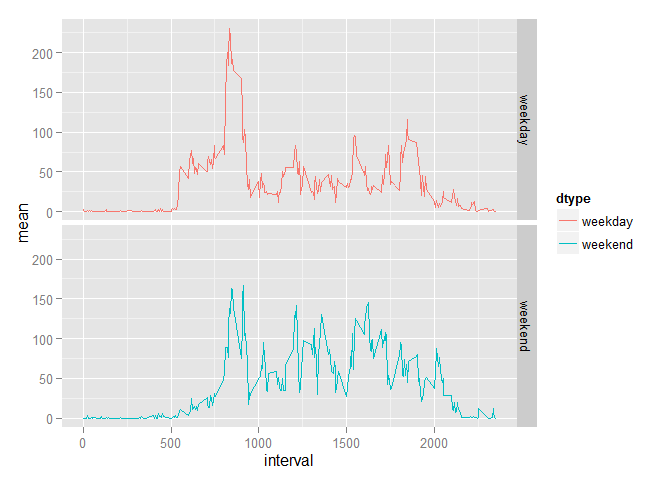

# Reproducible Research: Peer Assessment 1


## Loading and preprocessing the data


```r
library (lubridate)

data <-read.csv("activity.csv",head=TRUE)
data$date <- ymd(data$date)
```


## What is mean total number of steps taken per day?

```r
library (dplyr,warn.conflicts=FALSE)

sdata <- data %>% 
    group_by (date) %>%
    summarise (sum (steps, na.rm=TRUE))

colnames(sdata) <- c("date", "sum")

hist(sdata$sum,
     main="Histogram of total steps on a day",
     xlab="Steps taken on a day",
     col="RED")
```

 

```r
mean_steps   <- mean(sdata$sum,na.rm=TRUE)
median_steps <- median(sdata$sum,na.rm=TRUE)
```

Mean steps per day   : 9354

Median steps per day : 10395


## What is the average daily activity pattern?


```r
library(ggplot2)

sdata <- data %>% 
    group_by (interval) %>% 
    summarise (mean (steps, na.rm=TRUE))

colnames(sdata) <- c("interval","mean")

qplot(interval,
      mean,
      data=sdata, 
      geom="line", 
      main="Mean steps per interval")
```

 


```r
int <- sdata  %>% 
    filter (mean==max(mean)) %>% 
    select(interval)
```

Interval with the maximum number of steps is : 835

## Imputing missing values


```r
na_count <- sum(is.na(data$steps))
```

Total number of missing values : 2304


```r
## replacing missing values with mean values of the intervals.
ndata <- data

sdata <- data %>% 
    group_by (interval) %>% 
    summarise (mean (steps, na.rm=TRUE))

colnames(sdata) <- c("interval","mean")

replacement <- ndata %>% 
    select(interval,steps) %>% 
    filter (is.na(steps)) %>% 
    inner_join(.,sdata) %>% 
    select(mean)
```

```
## Joining by: "interval"
```

```r
ndata$steps <- as.numeric(ndata$steps)
ndata$steps[is.na(ndata$steps)] <- as.numeric(replacement$mean)

sdata <- ndata %>% 
    group_by (date) %>% 
    summarise (sum (steps))

colnames(sdata) <- c("date", "sum")

hist(sdata$sum,
     main="Histogram of total steps on a day",
     xlab="Steps taken on a day",
     col="RED")
```

 

```r
mean_steps   <- mean(sdata$sum)
median_steps <- median(sdata$sum)
```

Mean steps per day   : 10766

Median steps per day : 10766

**Compared to the raw data, the modified data has a larger mean.**


## Are there differences in activity patterns between weekdays and weekends?


```r
ndata <- data

sdata <- data %>% 
    group_by (interval) %>% 
    summarise (mean (steps, na.rm=TRUE))

colnames(sdata) <- c("interval","mean")

replacement <- ndata %>% 
    select(interval,steps) %>% 
    filter (is.na(steps)) %>% 
    inner_join(.,sdata) %>% 
    select(mean)
```

```
## Joining by: "interval"
```

```r
ndata$steps <- as.numeric(ndata$steps)
ndata$steps[is.na(ndata$steps)] <- as.numeric(replacement$mean)

## create a frame to map day to type
days <- c("Monday","Tuesday","Wednesday","Thursday","Friday","Saturday","Sunday")
type <- c("weekday","weekday","weekday","weekday","weekday","weekend","weekend")
dtype           <- data.frame(cbind(days,type))
colnames(dtype) <- c("day","dtype")

ndata$day   <-weekdays(ndata$date)
wdata       <-inner_join(ndata,dtype)
```

```
## Joining by: "day"
```

```
## Warning in inner_join_impl(x, y, by$x, by$y): joining character vector and
## factor, coercing into character vector
```

```r
wdata$dtype <-as.factor(wdata$dtype)

fdata <- wdata %>% 
    select (interval,dtype,steps) %>% 
    group_by(interval,dtype) %>%  
    summarise(mean = mean(steps))

qplot(interval,
      mean,
      data=fdata,
      facets=dtype~., 
      geom="line",
      color=dtype)
```

 
